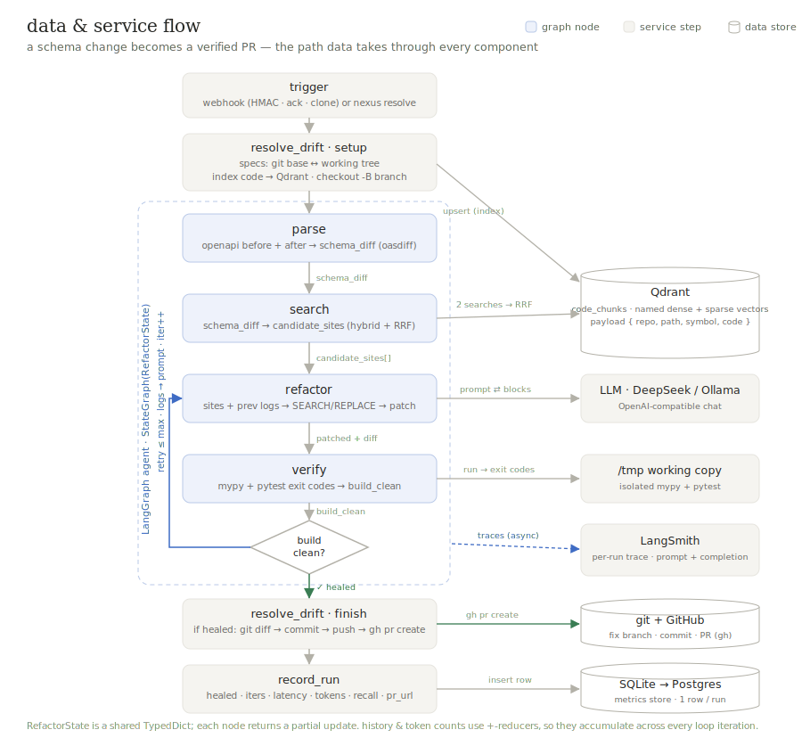
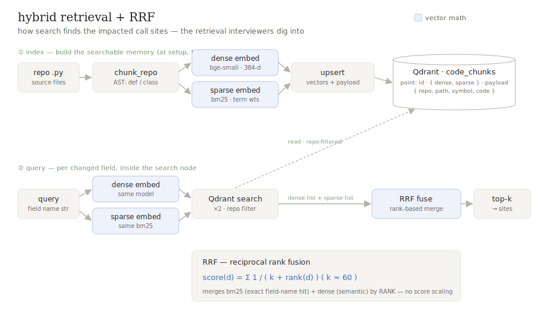
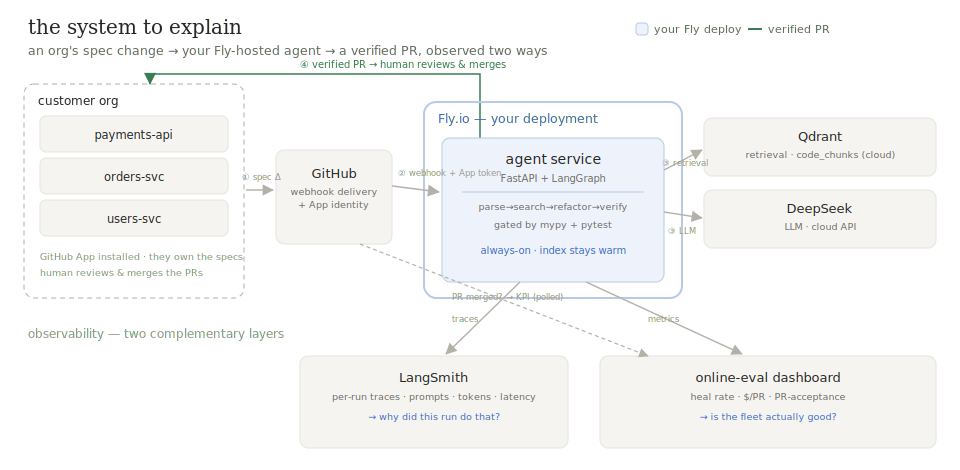

# NexusRefactor

**An autonomous agent that heals API schema drift.** An upstream OpenAPI spec changes — a field
renamed, a type altered — and downstream code silently breaks. NexusRefactor finds the impacted
call sites, rewrites them, and opens a pull request — but only if `mypy` and `pytest` pass. The
loop is steered by **compiler-grade signals, not an LLM grading its own work.**

> `LangGraph` cyclic agent · `Qdrant` hybrid retrieval · `mypy`+`pytest` gate · `FastAPI` on `Fly.io` · `LangSmith` tracing

## How it works

<p align="center"></p>

A webhook (or the CLI) hands the before/after specs to a **LangGraph** agent that loops over a typed state:

**parse** (`oasdiff` → typed `SchemaDelta`) → **search** (hybrid retrieval → ranked call sites) →
**refactor** (LLM → `SEARCH/REPLACE` edits on an isolated copy) → **verify** (`mypy` + `pytest`).

On failure with budget left, it loops back to `refactor` **with the failure logs in the prompt** —
self-heal. Only a green build opens a PR; the bounded retry budget guarantees termination.

## Design decisions

The interesting part isn't that an LLM writes a patch — it's what keeps it honest and reliable.

| Decision | Why |
|---|---|
| Verify with **`mypy` + `pytest` exit codes**, not LLM self-assessment | An objective signal the model can't talk its way past — no reward hacking. The compiler is the judge. |
| **Cyclic** agent (LangGraph) with a **bounded** retry budget | The fix is iterative — patch, check, re-patch against the *actual* failure. The loop **is** the product; the budget is the termination guarantee. |
| **Hybrid** retrieval (dense + BM25) fused by **RRF** | Drift is both lexical (the renamed identifier) and semantic (the concept). RRF merges by **rank**, so there's no cosine-vs-BM25 score to normalize. |
| **`SEARCH/REPLACE`** edits, not unified diffs | LLMs reliably botch diff line numbers; content-anchored blocks apply with a tolerant matcher. |
| **Working-copy isolation** for verify | The agent runs code it just wrote; `/tmp` isolation contains the blast radius (and fixes `mypy`'s duplicate-source error). |
| **Orchestrator / agent split** | The agent returns a *verified patch*; the orchestrator owns git, GitHub, and metrics — so the front door (CLI ↔ webhook ↔ queue) is swappable. |
| **LLM behind a `Protocol`** | Ollama for dev, DeepSeek/OpenAI for prod — an adaptive router drops in without a rewrite. |

## Retrieval — hybrid, fused by RRF

<p align="center"></p>

Each AST-chunked snippet is embedded **twice** into one **Qdrant** collection — dense (`bge-small`,
semantic) + sparse (BM25, lexical), with a `{repo, path, symbol}` payload for tenant filtering. A
query is embedded both ways, searched, and the two ranked lists fused by **RRF** (`Σ 1/(k+rank)`) —
rank-based, so incompatible scores never need normalizing. You need both legs: drift is an exact
renamed identifier *and* the concept behind it.

## Evaluation — measured, not claimed

**No number is written down until it's measured, with a CI and an honest N.** (A fabricated
benchmark table from the original spec was deleted — see [DECISIONS.md](docs/DECISIONS.md).)

- **Offline** — a golden set run through the full loop; heal rate, context recall, and patch
  minimality reported with **bootstrapped 95% CIs**. Small on purpose (N=5), so intervals are wide
  and no headline % is claimed — growing it is ongoing.
- **Online** — every real run records heal rate, latency, token cost, and its PR to a metrics store
  (`/metrics`). Offline gates regressions; online measures production. Merge-outcome polling — *did
  a human accept the PR?*, the north-star — is next.

## Deployment & observability

<p align="center"></p>

Containerized and **deployed on Fly.io** (scale-to-zero) against managed **Qdrant Cloud**, secrets
injected at runtime. Two front doors, one core: a CLI and an **HMAC-verified FastAPI webhook** (push
→ background job → PR). Observed two ways — **LangSmith** traces each run (nodes + the LLM's exact
prompt/completion — *why did it do that?*); the **metrics store** tracks KPIs (heal rate, latency,
cost — *is the fleet any good?*). *(Acts via a scoped token today; a least-privilege **GitHub App**
identity is next.)*

## Stack

| | |
|---|---|
| **Orchestration** | LangGraph — cyclic, stateful agent with reducers on shared state |
| **Retrieval** | Qdrant (named dense + sparse vectors, payload filtering) · fastembed (`bge-small-en-v1.5` + `bm25`) · RRF |
| **LLM** | DeepSeek · Ollama · OpenAI — behind an `LLMProvider` `Protocol` |
| **Verification** | `mypy` + `pytest` (the gate) · `oasdiff` (OpenAPI structural diff) |
| **Serving & deploy** | FastAPI + uvicorn · Docker · Fly.io |
| **Observability** | LangSmith (per-run traces) · SQLite→Postgres metrics store |
| **Tooling** | uv · ruff · mypy · Python 3.12 |

## Status

- **Live & measured:** the heal loop, hybrid retrieval, offline + online eval, deploy on Fly.io, LangSmith tracing.
- **Next:** GitHub App identity · PR-acceptance polling + a metrics dashboard · a larger, harder eval set.
- **Further out (GPU-gated, measured-only):** a fine-tuned served model + an adaptive local/frontier router.

## Run it

```bash
brew install oasdiff                 # OpenAPI structural differ (used by `parse`)
make sync && make up                 # deps via uv (Python 3.12) + local Qdrant (docker)
cp .env.example .env                 # add an LLM key — or run fully local with LLM_PROVIDER=ollama
make run SCENARIO=eval/golden/example_rename_field   # heal one scenario (prints its LangSmith trace URL)
make eval                            # golden-set harness with bootstrapped CIs
```

**Deeper reading:** [ARCHITECTURE.md](docs/ARCHITECTURE.md) · [FLOWS.md](docs/FLOWS.md) ·
[DECISIONS.md](docs/DECISIONS.md). Core logic: `src/nexus_refactor/nodes/`, `retrieval/`, `graph.py`.
