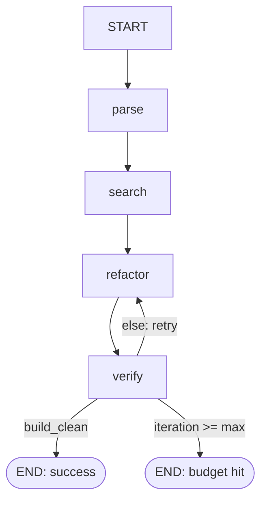

# Architecture

> Visual companion: **[FLOWS.md](FLOWS.md)** — the end-to-end data & service flow (trigger → verified
> PR) and the hybrid-retrieval + RRF internals as diagrams, with the interview "why" behind each choice.

## The graph (Phase 1a)

A **cyclic, stateful graph** — never call it a "cyclic DAG"; that's a contradiction, and
LangGraph exists precisely *because* it allows cycles. The cycle is the self-heal loop.

- **parse** — OpenAPI before/after → normalized `SchemaDelta` (deterministic; no LLM). A zeroth
  pass (`spec_changed`, deep structural equality) flags the "spec changed but delta empty" case —
  a differ blind spot vs. genuinely no drift.
- **search** — delta → candidate call sites via hybrid retrieval.
- **refactor** — LLM drafts/extends a patch over the candidates; on retries it also sees the
  previous failure log. This feedback is what makes it *self-heal* rather than retry blindly.
- **verify** — runs the build gate, captures exit codes + logs.
- **should_continue** — the termination gate. `done` / `exhausted` / `retry`. The bounded budget
  is why the cycle can't spin forever.

A linear pipeline wouldn't need LangGraph. The loop + the conditional gate are the justification.

## State (`src/nexus_refactor/state.py`)

LangGraph state is a `TypedDict`; each node returns a **partial** update that LangGraph merges.
Most keys overwrite. `history` uses a **reducer** (`operator.add`) so updates *append* — that's
how you accumulate a log across loop iterations. `total=False` lets the initial state omit keys
that later nodes fill in.

## The verify signal — "why mypy + pytest is our compiler"

The thesis is that the loop is steered by an **objective** signal — a compiler exit code, not an
LLM grading its own work. Python has no compile step, so the honest analog is:

| Signal | Tool | Catches |
| --- | --- | --- |
| "compile" | `mypy` | Attribute/type/signature drift — exactly what schema changes cause (e.g. `resp.user_name` after the field became `username`). Static, fast, deterministic. |
| behavior | `pytest` | That the patched code still does the right thing on the localized tests. |

`build_clean` is `True` **only if both exit 0**. Be ready to explain this mapping in an
interview — it's a strength (objective, reproducible), and naming it precisely ("mypy stands in
for the type-check that a compiled language gets for free") shows you understand *why* the
compiler-grounded loop is more defensible than faithfulness scoring.

## Hybrid retrieval (Phase 1b)

One Qdrant collection, two vectors per code chunk:

- **dense** (semantic): captures *intent* — "reads the user's display name".
- **sparse / BM25**: captures *exact tokens* — the identifier `user_name`, the type `UserService`.
- **fusion**: Reciprocal Rank Fusion combines the two rankings. RRF uses ranks, not raw scores,
  so you don't have to reconcile cosine distance against BM25 term weights (different scales).
- **payload filtering**: restrict to a repo/service via payload to cut context bloat.

Schema drift needs both legs: you're chasing an exact renamed identifier *and* the places that
use the concept it stands for. See `retrieval/` and `docs/ROADMAP.md` for the build order.

## Trust boundary (Phase 1d)

The agent executes code an LLM just edited. Even the minimal version runs verify behind a
denylist + timeout (`sandbox/`), and graduates to container isolation (`--network none`, non-root,
resource limits) before you trust it on anything you didn't write. Full Guardrails-AI validation
and a written threat model are Phase 2.
